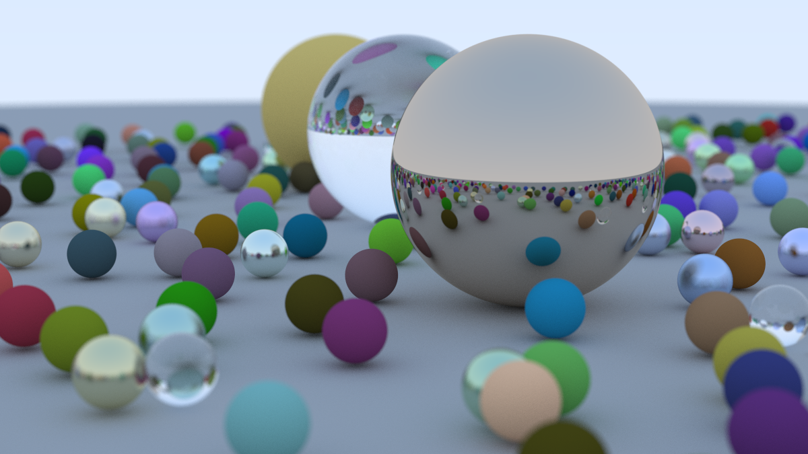
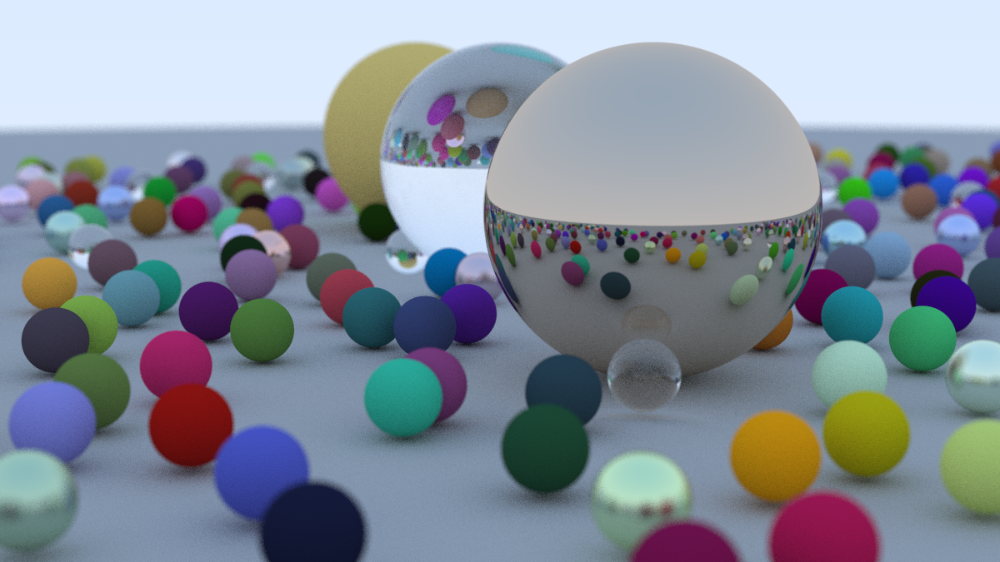

# RayTracer

A learning project following Peter Shirley's book series [_Ray Tracing in One Weekend_](https://github.com/RayTracing/raytracing.github.io) (Version 4.0.2, 2025-04-25)

The goal for the first book is to create a C++ ray tracer which can create good-looking images

---

## Current features

- A brute-force raytracer in C++11 (might upgrade to newer now that I've finished the first book)
- Outputs images in **P3 PPM** format
- Some command line arguments (will add more)
- Progress indicators while rendering
- Supports spheres as shapes
- Many randomized properties to provide unique renders each time
- Multithreading support for significantly faster renders

---

## Example renders

Image properties:

- width: 1200
- height: 675
- samples per pixel: 500
- max_depth: 50

- samples per pixel: 100

